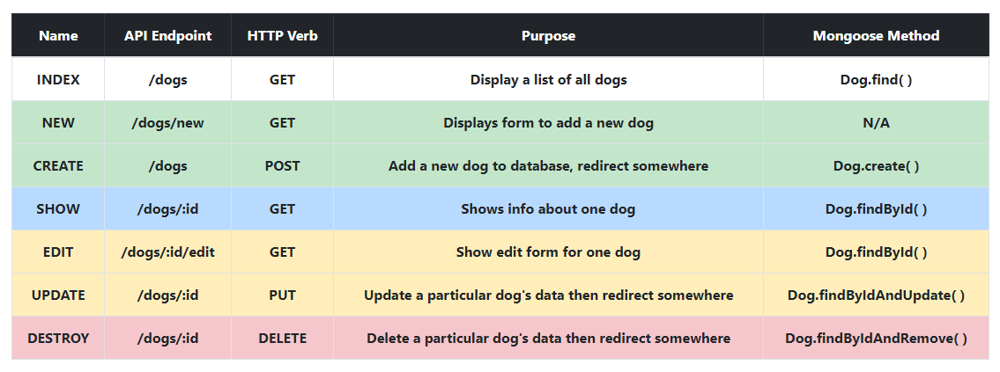
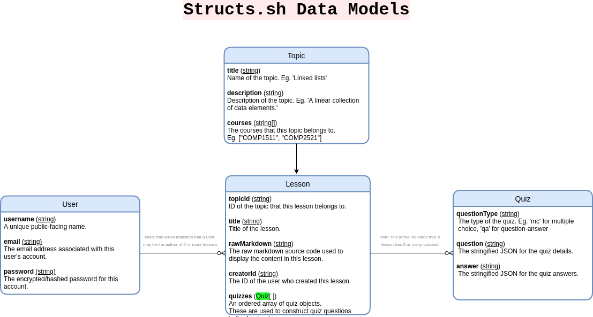

# Structs.sh 💻

<p align="center">
    <a href=""></a>
</p>
<p align="center">
    <strong><a href="https://structs.netlify.app/">Visit Structs.sh</a></strong>. 
</p>


Structs.sh is an interactive data structure and algorithm visualiser and educational platform for computer science students.

---

# Table of contents

-   [Setup Instructions (Development)](#setup-instructions)
-   [Running Structs.sh](#running-structs)
-   [Documentation](#documentation)
    - [Client & Server Directory Structure](#)
    - [Visualiser Project Directory Structure](#visualiser-project-directory-structure)
    - [Structs.sh API Docs](#structs-api-documentation)
-   [Guidelines](#guidelines)
    - [Getting Started With Backend Development](#getting-started-with-backend-development)
    - [Getting Started With the Visualiser](#getting-started-with-the-visualiser)
-   [Git Contribution Guidelines](#git-contribution-guidelines)
-   [Style Guidelines and Practices](#style-guidelines-and-practices)

---

## Setup Instructions
Note: this is using **node.js v14.17.0**.

```bash
# Clone the repo
git clone https://github.com/csesoc/Structs.sh.git
```

### Automatic Setup [Experimental]
This may only work on Linux environments.
```bash
# After cloning the repo, run the following in the root directory
sh structs.sh --setup
```
Follow the prompts and everything should be ready to go.

### Manual Setup

```bash
# After cloning the repo, run the following in the root directory
npm --prefix ./install ./client install
npm --prefix ./install ./server install
```

## Running Structs
From the root directory, you can use the Structs.sh CLI tool:
```bash
sh structs.sh --frontend     # Starts the frontend development server on port 3000
sh structs.sh --backend      # Starts the backend development server on port 8080
```

Alternatively, you may run the npm start script from the `client` and `server` directories.
```bash
# In the `client/` directory:
npm start

# In the `server/` directory:
npm start
```

---

# Documentation

## Client & Server Directory Structure
Below is a view of the project's directory hierarchy with succinct annotations. 
```bash
.
│
├── structs.sh     # → Shell script for setting up and starting up the Structs.sh
│
├── client/
│       │
│       └── src
│           ├── index.tsx
│           ├── assets           # → Contains public assets such as images and CSS/SCSS. Most global style rules exist here
│           ├── components       # → Where all our components are stored. Make new directories for your components here
│           ├── content          # → Contains helpers for fetching lesson content
│           ├── layout           # → Components defining page structure
│           └── views                      # → Where our page components are stored.
│               ├── HomePage.js            # → Structs.sh homepage
│               ├── Dashboard.js           # → The visualisation and main content page
│               # ... more pages would go here
│
└── server/
    │
    ├── src
    │   ├── database-helpers     # → The files in here contain helper functions for reading/writing to the database 
    │   │   └── user.ts
    │   ├── routes               # → Where all our API endpoints and handlers live
    │   │   ├── auth.ts
    │   │   # ... more routes
    │   ├── schemas              # → Contains all the files that define what our MongoDB collections look like
    │   │   ├── user
    │   │   │   └── user.ts      # → Eg. this file makes the 'users' collection and defines what fields a user document should have 
    │   │   # ... more schema definitions
    │   ├── server.ts            # → This is the entry point. Config and server startup happesn here
    │   ├── typedefs             # Backend type definitions are kept here
    │   │   ├── user
    │   │   │   └── User.ts
    │   │   # ... more type definitions
    │   └── utils                # → Global helper functions
    │       └── index.ts
    └── tests                    # → Our unit tests
        └── sample.test.js
```

## Visualiser Project Directory Structure
```bash
visualiser-new/
	└── src
	    ├── App.tsx                   # → The React root element. Contains the visualiser's basic UI such as the canvas, the 
	    │                             #   form and the buttons.
	    ├── index.js
	    ├── styles
	    │   ├── index.css
	    │   └── Landing.css 
	    └── visualiser-scripts        # → Visualiser source code. This is completely independent from React
	        ├── controller.js         # → This is the entry point. The visualiser is initialised and set up to be ready
	        │                         #   to receive and execute commands. When the user clicks 'append', it's the controller's 
	        │                         #   responsibility to play the animation, handle play/pause, reversing and history
	        ├── createNode.js         # → Where nodes are built and spawned onto the canvas
	        ├── createSequence.js     # → Where the animation sequence for each command is generated. This is where the 
	        │                         #   algorithm's logic is coupled with animation generation
	        ├── runSequence.js        # → Where the animation is actually played
	        └── utils.js      
```

## Structs API Documentation

Structs.sh features a RESTful API for content management, supporting the retrieval, creation, updating and deletion of lessons and quizzes.  

<details>
    <summary>RESTful API conventions</summary>
    
</details>

### Authentication

<table>
    <tbody>
        <tr>
            <th>Endpoint</th>
            <th>Parameters</th>
            <th>Response</th>
            <th>Description</th>
            <th>Exceptions</th>
        </tr>
        <tr>
            <td>
                <pre>POST /api/auth/register</pre>
            </td>
            <td>
                <ul>
                    <li>
                        username
                    </li>
                    <li>
                        email
                    </li>
                    <li>
                        password
                    </li>
                </ul>
            </td>
            <td>
                <pre>Nothing for now</pre>
            </td>
            <td>
                Registers a new user for Structs.sh.
            </td>
            <td>
                <ul>
                    <li>Emails must be of a valid format</li>
                </ul>
                TODO: think of a few more. 
            </td>
        </tr>
        <tr>
            <td>
                <pre>POST /api/auth/login</pre>
            </td>
            <td>
                <ul>
                    <li>
                        email
                    </li>
                    <li>
                        password
                    </li>
                </ul>
            </td>
            <td>
                <pre>Nothing for now</pre>
            </td>
            <td>
                Logs in an existing Structs.sh user.
            </td>
            <td>
                <ul>
                    <li>Password must match the stored encrypted password</li>
                </ul>
                TODO: think of a few more
            </td>
        </tr>
    </tbody>
</table>


### Lessons

<table>
    <tbody>
        <tr>
            <th>Endpoint</th>
            <th>Parameters</th>
            <th>Response</th>
            <th>Description</th>
            <th>Exceptions</th>
        </tr>
        <tr>
            <td>
                <pre>GET /api/lessons</pre>
            </td>
            <td>
                None
            </td>
            <td>
                List of <strong>lessons</strong>
            </td>
            <td>
                Fetches a list of all the lessons in Structs.sh
            </td>
            <td>
                None
            </td>
        </tr>
        <tr>
            <td>
                <pre>GET /api/lessons/:id</pre>
            </td>
            <td>
                <ul>
                    <li>lessonId</li>
                </ul>
            </td>
            <td>
                <strong>lesson</strong>
            </td>
            <td>
                Fetches a single lesson with the given ID
            </td>
            <td>
                <ul>
                    <li>Lesson with the given ID doesn't exist</li>
                </ul>
            </td>
        </tr>
        <tr>
            <td>
                <pre>POST /api/lessons</pre>
            </td>
            <td>
                <ul>
                    <li>rawMarkdown (str)</li>
                    <li>creatorId (str)</li>
                </ul>
            </td>
            <td>
                <strong>lesson</strong>
            </td>
            <td>
                Creates a new lesson.
            </td>
            <td>
                <ul>
                    <li><strong>rawMarkdown</strong> is longer than 10000 characters</li>
                    <li><strong>creatorId</strong> doesn't correspond to an existing user</li>
                </ul>
            </td>
        </tr>
    </tbody>
</table>

### Quizzes

<table>
    <tbody>
        <tr>
            <th>Endpoint</th>
            <th>Parameters</th>
            <th>Response</th>
            <th>Description</th>
            <th>Exceptions</th>
        </tr>
        <tr>
            <td>
                <pre>GET /api/lessons/quiz</pre>
            </td>
            <td>
                <ul>
                    <li>lessonId</li>
                </ul>
            </td>
            <td>
                List of <strong>quizzes</strong> for a <strong>lesson</strong>
            </td>
            <td>
                Fetches a list of all the quizzes for a lesson.
            </td>
            <td>
                <ul>
                    <li><strong>lessonId</strong> doesn't correspond to an existing lesson</li>
                </ul>
            </td>
        </tr>
        <tr>
            <td>
                <pre>POST /api/lessons/quiz</pre>
            </td>
            <td>
                <ul>
                    <li>lessonId (str)</li>
                    <li>questionType (str)</li>
                    <li>question (str)</li>
                    <li>answer (str)</li>
                </ul>
            </td>
            <td>
                <strong>lesson</strong>
            </td>
            <td>
                Creates a new quiz under the lesson with the given ID.
            </td>
            <td>
                <ul>
                    <li><strong>lessonId</strong> doesn't correspond to an existing lesson</li>
                    <li><strong>questionType</strong> must be one of the strings: 'mc' (multiple choice) or 'qa' (question-answer format)</li> 
                </ul>
            </td>
        </tr>
    </tbody>
</table>

### Data Model



# Guidelines

## Getting Started With Backend Development


## Getting Started with the Visualiser 

Familiarise yourself with the [visualiser project directory structure](#visualiser-project-directory-structure). One important idea about the way this project is structured is that it is basically a standard React codebase, **except** the visualiser's source code in `visualiser-scripts` is totally standalone from the React codebase. The reasons for structuring it this way are:  
- To ensure that whatever we build can be readily migrated into our primary React frontend codebase. 
    - Keeping the visualiser source code free from React means we won't be being forced into programming in the paradigm encouraged by the framework (eg. React encourages writing [declarative code](https://stackoverflow.com/questions/33655534/difference-between-declarative-and-imperative-in-react-js), meaning that imperative animation code can't be written without frequent use of hooks - which quickly becomes unmaintainable).
- To take advantage of the toolchain set up by `create-react-app`. This means we can easily access a great development environment that we're all used to, including features like hot-reloading and modern JavaScript syntax (eg. `import`/`export`, `class`, `async`/`await`, etc.).

Suppose we want to implement a `search` operation for linked lists. The steps to this (very roughly, for now) are:

1. In `App.tsx`, Add an `<input id="searchValue" ... />` element and a `<button id="searchButton">Search</button>` element
2. In `controller.js`, add an event handler function and bind that event handler to the button you added. User the other event handlers in `controller.js` as a reference. 
3. In the `createSequence` function in `createSequence.js`, add another `else-if` block and write the algorithm for generating the sequence of animation objects (which will later be stepped through by anime.js). 
    - Note: In doing this, you are also defining the 'style' for each animation step *imperatively*.
        - To see what properties you can style with Anime.js, see [here](https://animejs.com/documentation/#cssProperties). In general, anything you can style with CSS (eg. height, width, colour, position, scale, etc.) can be animated
    - Idea: In the future, defining the styling declaratively could be more flexible and readable (eg. rather than `translateX: '+=100'`, you would just write something like `action: shiftRight`). This would allow the animation sequence generator to be made more independent from the styling of the animation (in a similar way to how CSS is independent to HTML)


---

## Good Collaborative Coding Practices

### Git Guideline

<details>
    <summary>Git contribution guidelines</summary>

-   Have one branch per feature. Name the branch according to the name convention `<initials>/<feature-name>`, for example, `JS/dashboard` for John Smith
-   Commit frequently with short and meaningful messages
-   When ready to merge into master, first merge master into your branch and deal with conflicts on YOUR branch
-   Open a pull request merging your branch into master
    1. Click `Pull requests` on the top toolbar of this page
    2. Set the base repo to be `csesoc/Structs.sh`
    3. Set the branch you want to merge into master
    4. Click `Create pull request`. You'll be prompted to add a description afterwards
    5. Once the pull request is opened, someone else must approve it
    6. Once approved, it'll be merged into master!
</details>

### Style Guidelines 

Based on <a href="https://github.com/airbnb/javascript/tree/master/react">Airbnb's official React style guide</a>.

<details>
<summary>Files and naming</summary>
<p>

-   One component per file

-   Prefer functional components over class components

    -   They're easier to test
    -   Less code, hence easier to read and maintain
    -   Possible performance boost in future versions of React
    -   Only use class components when there's complex internal state

-   Use `.jsx` extension for React components and `.js` for every other file

    -   If using TypeScript, then use `.tsx` and `.ts`

-   Naming
    -   `PascalCase` for React components
        -   Give it the same name as the filename. Eg. for `LinkedList.jsx`, name the React component inside to be `LinkedList`
    -   `camelCase` for everything else

</p>
</details>

<details>
<summary>Indentation</summary>
<p>

-   Splitting up long prop lines:

    ```javascript
    <Foo superLongParam="bar" anotherSuperLongParam="baz" />
    ```

-   Conditional rendering:

    ```javascript
    // && operator
    {
        showButton && <Button />;
    }

    // Ternary operator ()
    {
        someConditional ? <Foo /> : <Foo superLongParam="bar" anotherSuperLongParam="baz" />;
    }
    ```

</p>
</details>

<details>
<summary>JSX</summary>
<p>

-   Spacing

    ```javascript
    // Very bad
    <Foo      bar={ baz }    />

    // Good
    <Foo bar={baz} />
    ```

-   Wrap JSX in parentheses
    ```javascript
    return <MyComponent variant="long body" foo="bar" />;
    ```

</p>
</details>

<details>
<summary>Components</summary>
<p>

-   Use 'object destructuring' to get prop arguments

    ```js
    // Don't repeat props everywhere :(
    const Input = (props) => {
        return <input value={props.value} onChange={props.onChange} />;
    };

    // Destructure and use the straight values :)
    const Input = ({ value, onChange }) => <input value={value} onChange={onChange} />;
    ```

-   Always set default props so that the component never crashes when you don't pass in a specific prop
    ```js
    const Component = ({
        title: 'Default Title',
        subtitle: 'Generic Subtitle'
    }) => {
        return (
            <div>
                ...
            </div>
        );
    }
    ```

</p>
</details>

<details>
<summary>Styling with SCSS modules</summary>
<p>

Using global CSS/SCSS is an absolute nightmare in a large project because you have name collisions and specificity issues.
With SCSS modules, every classname you define is 'mangled' so that it is always unique and is guaranteed to never
conflict with any other classname in the project.

How this works:

1. Suppose you're working on `LinkedList.jsx`. Add a new file called `LinkedList.module.scss`
2. Write your SCSS code in that file. Remember SCSS is a superset of CSS so you can just write regular CSS.
    ```scss
    .container {
        margin: 10px;
    }
    ```
3. Import the scss module in `LinkedList.jsx` and apply the style like this:

    ```js
    import styles from './LinkedList.module.scss';

    const LinkedList = () => {
        return <div className={styles.container}>...</div>;
    };
    ```

</p>
</details>

<details>
<summary>Quotes</summary>
<p>

-   Use double quotes `"..."` for prop passing and `'...'` for everything else

</p>
</details>

<details>
<summary>General tips</summary>
<p>

-   DRY - 'don't repeat yourself', (ie. don't do what Tim does)

</p>
</details>
