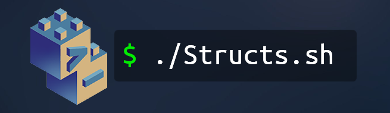

# Structs.sh 💻

    

    
    
    
    

    <strong>
        <a href="https://structs.sh">Visit Structs.sh</a>
    </strong> |
    <strong>
        <a href="https://compclub.atlassian.net/wiki/spaces/S/overview?homepageId=2142995642">
            Structs.sh Confluence
        </a>
    </strong>

> See the [Structs.sh Confluence workspace](https://compclub.atlassian.net/wiki/spaces/S/overview?homepageId=2142995642) for documentation, **setup instructions**, deployment instructions, milestones and project management!

## About Structs.sh

Structs.sh is an interactive data structure and algorithm visualiser and educational platform for computer science students.

## Features:

- Algorithm visualisation
  - Interactive animation player for visualising fundamental operations on classic data structures such as linked lists, binary search trees, graphs, etc.
  - Control the visualiser through an integrated terminal
- Hub for educational computer science content and teaching resources
  - Lessons, videos, reference implementations in specific programming languages, all in one place
- Content management system
  - Create new topics, source code snippets, lessons and quizzes

---

## Why Structs.sh Exists

Structs.sh is a project that aims to be a comprehensive educational resource for data structures and algorithms, developed by passionate computer science and engineering students at UNSW. Structs.sh was inspired by a previous project, <a href="https://github.com/Tymotex/Tactile-DS">Tactile-DS</a>, an earlier project developed in 2020 as a tutoring tool and reference implementation for students to use in <a href="https://www.handbook.unsw.edu.au/undergraduate/courses/2022/COMP2521/?year=2022">COMP2521</a>.

Structs.sh exists to help bridge the gap between a student's high-level understanding of computer science concepts and how real code would accomplish a certain task. The project was started by students who felt there was a lack in tools/resources that focus on helping people develop a proper visual intuition for algorithmic thinking.

## Running Structs.sh

### Prerequisites

Ensure you have the following software:

- git
- Node.js (v18 or later)
  - [nvm](https://github.com/nvm-sh/nvm) is recommended to easily manage and install versions of node
- (_Optional_) Docker and Docker-compose

### Setup

Clone the repository using the commmand: `git clone git@github.com:csesoc/structs.sh.git`

### Running the frontend without Docker

1. `cd` into the `client` directory
2. Run `npm install` to install node modules
3. Run `npm start` to start the server. The frontend should be accessible at `localhost:3000`

### Running the app with Docker

1. `cd` into the project root directory
2. Run `docker-compose up --build` The frontend should be accesible at `localhost:3000`. The debugger server should be accessible at `localhost:5000`.

## Documentation

For everything architecture, endpoints documentation, style guide, etc. see
our <a href="https://compclub.atlassian.net/wiki/spaces/S/overview?homepageId=2142995642">Confluence workspace</a>!
