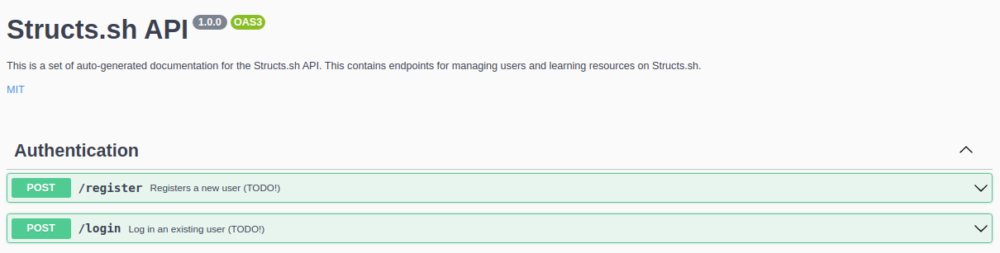

# Structs.sh 💻

<p align="center">
    <a href=""></a>
</p>
<p align="center">
    <strong>
        <a href="https://structs.sh">Visit Structs.sh</a>
    </strong> 
</p>

### About Structs.sh

Structs.sh is an interactive data structure and algorithm visualiser and educational platform for computer science students.

### Features:

-   Algorithm visualisation
    -   Interactive animation player for visualising fundamental operations on classic data structures such as linked lists, binary search trees, graphs, etc.
    -   Control the visualiser through an integrated terminal
-   Hub for educational computer science content and teaching resources
    -   Lessons, videos, reference implementations in specific programming languages, all in one place
-   Content management system
    -   Create new topics, source code snippets, lessons and quizzes

## Why Structs.sh Exists

Structs.sh is a project that aims to be a comprehensive educational resource for data structures and algorithms, developed by passionate computer science and engineering students at UNSW. Structs.sh was inspired by a previous project, <a href="https://github.com/Tymotex/Tactile-DS">Tactile-DS</a>, an earlier project developed in 2020 as a tutoring tool and reference implementation for students to use in <a href="https://www.handbook.unsw.edu.au/undergraduate/courses/2022/COMP2521/?year=2022">COMP2521</a>.

Structs.sh exists to help bridge the gap between a student's high-level understanding of computer science concepts and how real code would accomplish a certain task. The project was started by students who felt there was a lack in tools/resources that focus on helping people develop a proper visual intuition for algorithmic thinking.

## Tech Stack and Architecture

Structs.sh was built with the MERN stack (MongoDB, Express, React, Node), using TypeScript for both the client and api codebases. It uses Material-UI (now called 'MUI') as the UI component system and <a href="https://animejs.com/">anime.js</a>, a lightweight and flexible JavaScript animation framework, for the visualiser.

## Setting Up and Running the Project

### Before you start:

-   Ensure you are have <a href="https://nodejs.org/en/download/">node.js</a> installed at version `v14.18.0`.
    -   Note: it's likely that the project will work with different later node.js versions as well
    -   <a href="https://github.com/nvm-sh/nvm">`nvm`</a> is a great choice for switching between node.js version
-   (Optional) Install <a href="https://docs.docker.com/get-docker/">Docker</a> and <a href="https://docs.docker.com/compose/install/">Docker-Compose</a>.

### With Docker (Recommended)

Note: you won't require any knowledge of Docker.

#### Steps:

1. Clone the repository: `git clone https://github.com/csesoc/Structs.sh.git`.
2. Change directories into the project root: `cd Structs.sh`.
3. Run: `docker-compose up --build`. You should be able to view the frontend at `localhost:3000` and the API server at `localhost:8080`.
    - Note: this can take several minutes the first time it is run, but will become faster when you run it again in the future because of <a href="https://docs.docker.com/develop/develop-images/dockerfile_best-practices/">Docker's caching magic</a>

### Without Docker

#### Steps:

1. Clone the repository: `git clone https://github.com/csesoc/Structs.sh.git`.
2. Change directories into the project root: `cd Structs.sh`.
3. Run: `yarn --cwd client/ install`.
4. Run: `yarn --cwd server/ install`.
5. In separate terminals, run `yarn start` in both `client` and `server` subdirectories. You should be able to then view the frontend at `localhost:3000` and the API server at `localhost:8080`.

## Deployment

This section is intended for developers on the CSESoc Projects team.

_Dockerised_ instances of Structs.sh's client application and API server are being run and managed by <a href="https://rancher.com/">Rancher</a>, which can be thought of as a managed <a href="https://kubernetes.io/">Kubernetes</a> service. The Rancher service runs 24/7 on _Wheatley_, a computer science research server physically located on UNSW's campus.

> Why use this seemingly overkill infrastructure? Because it was already in place and being adopted by other CSESoc projects. Although this isn't an enterprise application and doesn't have nearly the same scaling requirements and amount of traffic, deploying containers on Rancher is as simple as clicking a button.

### How to Deploy Structs.sh

The infrastructure for deployment has already been set up. Deployment was achieved by following <a href="https://compclub.atlassian.net/wiki/spaces/Projects/pages/733118519/How+to+deploy+a+project+on+Wheatley">this excellent guide</a>.

For developers, these are the only steps you need to care about to see changes appear in production:

1. Open a pull request for your feature branch to be merged into `master`. Wait for approval by another member.
2. After the branch is merged, Dockerhub will be notified of the new change to `master` and will try to build the <a href="https://hub.docker.com/repository/docker/csesocprojects/structs.sh-frontend">Structs.sh client Docker image</a> and <a href="https://hub.docker.com/repository/docker/csesocprojects/structs.sh-backend">backend Docker image</a>. You'll likely have to wait several minutes for this to be done.
    > It's likely that only the team leads will have access to the Dockerhub account containing all of CSESoc's production images
3. Once Structs.sh images are built, the team lead will need to go to the <a href="https://wheatley.cse.unsw.edu.au:7654/">Rancher admin page running on Wheatley</a> and redeploying the running container instances. The changes should become live very quickly

# Documentation

<p align="center">
    <strong><a href="https://www.figma.com/file/zFFuYLSSdc4TnQafDWgKP1/Structs.sh-Interface-Prototype?node-id=401%3A5">Figma Prototype</a>
    </strong> | <strong><a href="https://www.figma.com/file/KQcuxGJwz8I7trRlt69Vsy/Structs.sh-Brainstorming?node-id=0%3A1">FigJam</a></strong> |  <strong><a href="https://app.diagrams.net/#Hcsesoc%2FStructs.sh%2Fmaster%2Fstructs-datamodels.drawio">Data Model Diagram</a></strong>
</p>

## Structs API Docs

Structs.sh features a RESTful API for content management, supporting the retrieval, creation, updating and deletion of lessons and quizzes as well as the management of users.

When you start up the server on port 8080 for example, you'll see the API documentation being served at `http://localhost:8080/` which should look like this:

<p style="text-align: center;">
    
</p>

The documentation for the Structs.sh API was set up with <a href="https://www.npmjs.com/package/swagger-jsdoc">swagger-jsdoc</a> and <a href="https://www.npmjs.com/package/swagger-ui-express">swagger-ui-express</a>.

> Note: `swagger-jsdoc` generates an <a href="https://swagger.io/specification/">OpenAPI</a> spec from the <a href="https://jsdoc.app/">JSDoc</a> documentation written for each endpoint. The package `swagger-ui-express` serves the documentation which can be accessed by a route you define (eg. `/api-docs`). It takes in the output of `swagger-jsdoc` to achieve this.

> Developer Note: follow the YAML structure <a href="https://swagger.io/docs/specification/basic-structure/">here</a> for documenting endpoints in a way that can be used by Swagger.

<details>
    <summary>REST API conventions</summary>
    
</details>

### Data Model

<p style="text-align: center;">
    
</p>

> Note: This diagram was created and is currently maintained with <a href="https://draw.io/">draw.io</a>. VSCode has a great extension for an <a href="https://marketplace.visualstudio.com/items?itemName=hediet.vscode-drawio">integrated draw.io client</a> that lets you view and edit .drawio files in the editor.

> Note: To use the draw.io web app, go <a href="https://app.diagrams.net/#Hcsesoc%2FStructs.sh%2Fmaster%2Fstructs-datamodels.drawio">here</a> to modify the file `structs-datamodels.drawio` in this repository. To update the image below, just save the file (which will automatically create and push a commit) and then export a PNG file to replace `docs/structs-datamodels.drawio.png` in this repository.

# Developer Guidelines

### Git Guideline

<details>
    <summary>Git contribution guidelines</summary>

-   Have one branch per feature. Name the branch according to the name convention `<initials>/<feature-name>`, for example, `JS/dashboard` for John Smith
-   Commit frequently with short and meaningful messages
-   When ready to merge into master, first merge master into your branch and deal with conflicts on YOUR branch
-   Open a pull request merging your branch into master 1. Click `Pull requests` on the top toolbar of this page 2. Set the base repo to be `csesoc/Structs.sh` 3. Set the branch you want to merge into master 4. Click `Create pull request`. You'll be prompted to add a description afterwards 5. Once the pull request is opened, someone else must approve it 6. Once approved, it'll be merged into master!
</details>

### Style Guidelines

Based on <a href="https://github.com/airbnb/javascript/tree/master/react">Airbnb's official React style guide</a>.

<details>
<summary>Files and naming</summary>
<p>

-   One component per file

-   Prefer functional components over class components

    -   They're easier to test
    -   Less code, hence easier to read and maintain
    -   Possible performance boost in future versions of React
    -   Only use class components when there's complex internal state

-   Use `.jsx` extension for React components and `.js` for every other file

    -   If using TypeScript, then use `.tsx` and `.ts`

-   Naming
    -   `PascalCase` for React components
        -   Give it the same name as the filename. Eg. for `LinkedList.jsx`, name the React component inside to be `LinkedList`
    -   `camelCase` for everything else

</p>
</details>

<details>
<summary>Indentation</summary>
<p>

-   Splitting up long prop lines:

    ```javascript
    <Foo superLongParam="bar" anotherSuperLongParam="baz" />
    ```

-   Conditional rendering:

    ```javascript
    // && operator
    {
        showButton && <Button />;
    }

    // Ternary operator ()
    {
        someConditional ? <Foo /> : <Foo superLongParam="bar" anotherSuperLongParam="baz" />;
    }
    ```

</p>
</details>

<details>
<summary>JSX</summary>
<p>

-   Spacing

    ```javascript
    // Very bad
    <Foo      bar={ baz }    />

    // Good
    <Foo bar={baz} />
    ```

-   Wrap JSX in parentheses
    ```javascript
    return <MyComponent variant="long body" foo="bar" />;
    ```

</p>
</details>

<details>
<summary>Components</summary>
<p>

-   Use 'object destructuring' to get prop arguments

    ```js
    // Don't repeat props everywhere :(
    const Input = (props) => {
        return <input value={props.value} onChange={props.onChange} />;
    };

    // Destructure and use the straight values :)
    const Input = ({ value, onChange }) => <input value={value} onChange={onChange} />;
    ```

-   Always set default props so that the component never crashes when you don't pass in a specific prop
    ```js
    const Component = ({
        title: 'Default Title',
        subtitle: 'Generic Subtitle'
    }) => {
        return (
            <div>
                ...
            </div>
        );
    }
    ```

</p>
</details>

<details>
<summary>Styling with SCSS modules</summary>
<p>

Using global CSS/SCSS is a nightmare in a large project because you will likely encounter name collisions and CSS specificity issues.
With SCSS modules, every classname you define is 'mangled' so that it is always unique and is guaranteed to never
conflict with any other classname in the project.

How this works:

1. Suppose you're working on `LinkedList.jsx`. Add a new file called `LinkedList.module.scss`
2. Write your SCSS code in that file. Remember SCSS is a superset of CSS so you can just write regular CSS.
    ```scss
    .container {
        margin: 10px;
    }
    ```
3. Import the scss module in `LinkedList.jsx` and apply the style like this:

    ```js
    import styles from './LinkedList.module.scss';

    const LinkedList = () => {
        return <div className={styles.container}>...</div>;
    };
    ```

</p>
</details>

<details>
<summary>Quotes</summary>
<p>

-   Use double quotes `"..."` for prop passing and `'...'` for everything else

</p>
</details>

<details>
<summary>General tips</summary>
<p>

-   DRY - 'don't repeat yourself', (ie. don't do what Tim does)

</p>
</details>
