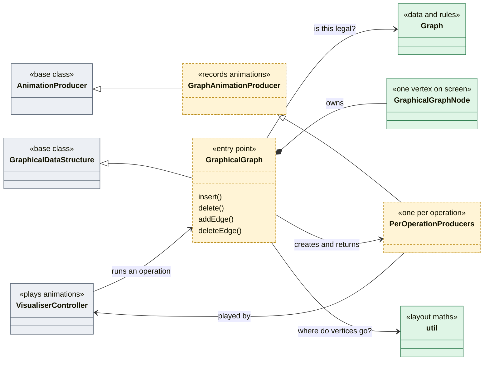

# Graph visualiser architecture

The graph visualiser at a glance: which classes exist and how they connect. For the detail, see `Graph_Visualiser_Spec.md`.

- Grey: shared code in `common/` and `controller/`. You use it but don't change it.
- Green: done.
- Dashed yellow: still to build.
- Triangle arrows mean "is a kind of", the diamond means "owns", and plain arrows mean "uses".

The per-operation producers are `GraphInsertAnimationProducer`, `GraphDeleteAnimationProducer`, `GraphAddEdgeAnimationProducer`, and `GraphDeleteEdgeAnimationProducer`. Each one just loads its C snippet into the code panel.
