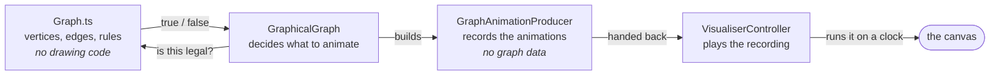
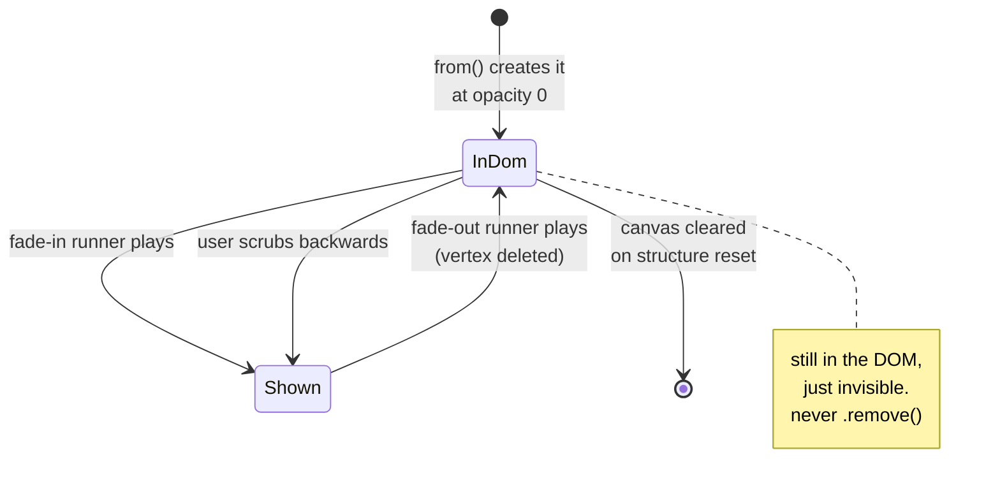
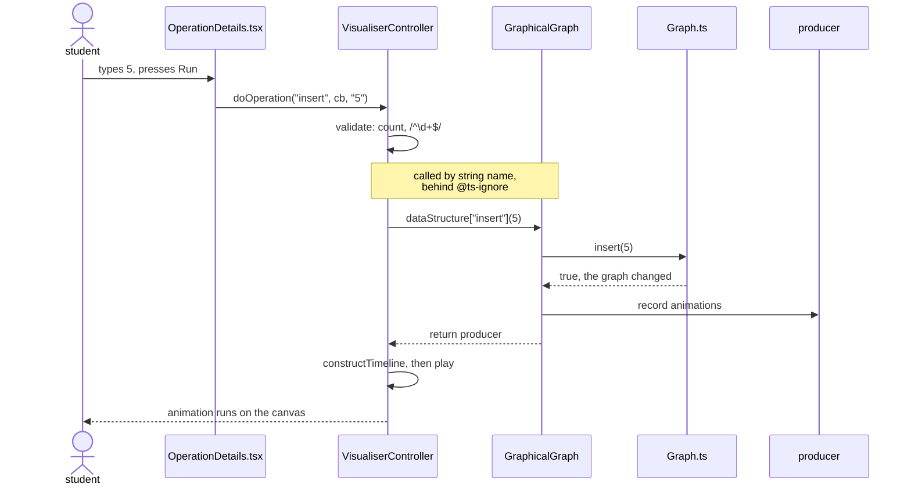

# Graph visualiser: spec and handover

This is for anyone picking up the feature. It assumes you're comfortable with React and TypeScript but have never worked on this visualiser. Anything specific to structs.sh gets explained as it comes up, and there's a glossary at the end.

The document describes what each piece has to do, in prose and pseudocode. It doesn't contain finished TypeScript, because writing that is the job. Where something similar exists elsewhere in the repo, it's named so you can read it as a reference.

Last verified against the tree on branch `graph-stubs`, 2026-09-22.

---

## 1. What we're building

A page at `/visualiser/graphs` where a student builds a graph up and tears it down one operation at a time, watching each step happen.

You type an operation and its arguments into a panel on the left and press Run. The graph animates on the canvas while the equivalent C code is highlighted line by line beside it. You can pause, scrub backwards and forwards, step through one beat at a time, and change the playback speed.

Four operations make up the whole release:

| Operation | Arguments | What it does |
|---|---|---|
| `insert` | a vertex number | adds a lone vertex, then re-spaces the circle |
| `delete` | a vertex number | removes a vertex and every edge touching it, then re-spaces the circle |
| `addEdge` | two vertex numbers | joins two vertices with one line |
| `deleteEdge` | two vertex numbers | removes the line between two vertices |

Graphs here are undirected, so an edge between 0 and 1 is the same edge as one between 1 and 0, drawn as a plain line with no arrowhead. They're also unweighted: no numbers on the edges.

Out of scope for this release:

- **Algorithms.** No breadth-first or depth-first search, no shortest path, no find. Each operation is a single change with a direct animation, so there's nothing to narrate beyond the change itself.
- **Automated tests.** The project has no test runner. The browser checklist in Task 3 is the acceptance gate.
- **Refactoring shared code.** Improvements to the linked-list visualiser or to `common/` belong in their own change.
- **C-debugger support.** Nothing under `visualiser-debugger/`.

---

## 2. How the visualiser works

### Three layers

**The model** is `data-structure/Graph.ts`. Plain TypeScript holding the actual graph: which vertices exist, which are connected, and every rule about what's legal (no self-loops, no duplicate edges, deleting a vertex cleans up its edges). It imports nothing from SVG, React, or the DOM. Ask it to do something and it returns `true` or `false` for whether the graph changed.

**The producer** is `animation-producer/GraphAnimationProducer.ts` and one subclass per operation. Given a change that already happened in the model, a producer records how to show it. It draws nothing and touches no graph data. Think of it as writing down a shot list.

**The controller** is `controller/VisualiserController.ts`, which you won't need to modify. It takes a producer's shot list and plays it on a clock, which is what makes the result pausable and scrubbable.

The split keeps "is this edge a duplicate?" out of the animation code and "what colour does this fade to?" out of the data code. The linked-list visualiser braids the two together in places and is harder to follow as a result.



### Runners and timelines

SVG.js, the drawing library, calls one queued property change a *runner*: "fade this circle's opacity from 0 to 1 over 400 milliseconds." Building a runner does not run it. It's an object describing a change, sitting inert until something plays it.

A *timeline* is the clock that plays runners. A *sequence* is a group of runners that all start at the same moment, so a circle and its number label can fade in together rather than one after the other.

When a producer method calls `addSequenceAnimation(...)`, it's adding to a shot list. Nothing moves on screen until the controller schedules that list and presses play.

### Why everything is created invisible

A runner can only animate a property of an element that already exists. There is no runner meaning "create a circle at second 3", because creating a DOM element is an instant action rather than something you can interpolate over time.

But the visualiser needs "a new vertex appears" to happen partway through a replayable animation. So:

1. Create the circle and its label immediately, with `opacity: 0`. They're in the DOM but invisible.
2. Queue a runner that fades opacity from 0 to 1 at the right moment.

Opacity stands in for existence. The fade-in is the creation as far as anyone watching is concerned, and because it's just a property animation it works with pause, step, and scrub like everything else.

That's why every attribute bundle in `util/constants.ts` ends with `opacity: 0`, and why `GraphicalGraphNode.from()` can create a node long before it's visible.

An element's whole life, from creation to the next reset:



### Why nothing may call `.remove()`

The same idea in reverse. When a vertex is deleted, its circle and label fade to `opacity: 0` and stay on the canvas. We never delete the DOM elements.

The timeline can be scrubbed backwards, and stepping back through a delete has to bring the vertex back. An element removed from the DOM can't be faded back in. The linked-list visualiser sets the same precedent: `LinkedListDeleteAnimationProducer.deleteNode` animates opacity and stops there.

The cost is that invisible elements pile up until the next structure reset, when the base class clears the whole canvas. We've accepted that.

### Where React is, and isn't

React renders the page shell once: the operation panel, the buttons, the `<svg id="visualiser-canvas">` container. It then never touches what's inside the canvas. Every circle, label, and line is created and mutated imperatively by SVG.js, with no component tree, props, or state describing the graph.

React does re-render small things, like the error message under the Run button and the scrubber position as the timeline advances. Never the graph itself.

### What happens when someone presses Run

This chain spans five files, and no single file shows the whole thing:



Step by step:

1. **The button**, in `components/Visualiser/VisualiserInterface/OperationDetails.tsx`. The input fields were generated by looping over the operation's documented argument list, so the UI shape comes entirely from the `documentation` object described in Task 2. Pressing Run calls `controller.doOperation(command, callback, ...args)` with the arguments as strings.
2. **Validation.** `VisualiserController` checks the argument count and that each one matches `/^\d+$/`, so non-negative integers only. Vertex `0` is fine. If validation fails it returns an error message and nothing animates.
3. **Dispatch**, at `VisualiserController.ts:198`:
   ```ts
   // @ts-ignore
   const animationProducer = this.dataStructure[command](...args.map(Number));
   ```
   The operation is called by its string name. `command` is `"insert"`, so `GraphicalGraph.insert(...)` runs.
4. **Your operation** mutates the model, builds a producer, records the animations, and returns the producer.
5. **Scheduling.** `constructTimeline` walks the producer's shot list, schedules each group of runners, and plays.

Two rules come straight out of steps 3 and 5. A `documentation` key has to exactly match a method name, because `this.dataStructure["add vertex"]` is `undefined` and calling it crashes at runtime, and the `@ts-ignore` stops the compiler catching it. And every operation has to return a producer even when it does nothing, because `constructTimeline` reads `.allRunners` off whatever it gets. An empty producer is fine; `undefined` crashes.

---

## 3. How the graph is laid out on screen

Vertices sit evenly spaced around an imaginary circle. The circle is only a rule for picking coordinates and is never drawn. The rectangular canvas is the real thing; the circle just decides where the vertex centres go.

### The radius is calculated, not chosen

You pick the minimum gap between neighbouring vertices, which is `MIN_NODE_SPACING = 102`: a 52-pixel-wide node plus 50 pixels of breathing room. The radius is then whatever value delivers that gap for the number of vertices currently on screen.

```
radius = MIN_NODE_SPACING / (2 × sin(π / n))        where n = number of vertices
```

More vertices means a smaller angle between neighbours, so the circle has to grow to keep them 102 apart:

| vertices | radius |
|---|---|
| 2 | 51 |
| 4 | 72 |
| 5 | 87 |
| 20 | 326 |

Four vertices, worked out in full. This is also what browser check 4 expects to see:

```
                            v0  (400, 228)
                             ●
                        ╱         ╲
                   102 ╱             ╲ 102
                      ╱                ╲
        (328, 300)   ●         ·         ●   (472, 300)
               v3         centre (400,300)      v1
                      ╲     radius 72         ╱
                   102 ╲                    ╱ 102
                        ╲                 ╱
                             ●
                            v2  (400, 372)

        radius 72, and every neighbouring pair sits 102 apart
```

This is why the layout is recalculated on every insert and delete. Freeze the radius at the value that suited four vertices and the ninth one overlaps its neighbours.

A single vertex is a special case. With no neighbour, the gap to your neighbour is meaningless and the formula divides by zero, so one vertex goes at the canvas centre instead. You reach this case by deleting down to one vertex, so it comes up in practice.

### Edges

An edge is a straight line between two vertex centres, trimmed by one node radius at each end so it starts and stops at the circles' rims rather than running through them. The trim is the same at both ends, because an undirected edge has no arrowhead.

```
    centre to centre, what you get without trimming:

           ╭───╮                           ╭───╮
           │ 0 ●───────────────────────────● 1 │
           ╰───╯                           ╰───╯
              the line runs through both circles

    what getEdgePath returns:

           ╭───╮                           ╭───╮
           │ 0 │───────────────────────────│ 1 │
           ╰───╯                           ╰───╯
            └ 26px trimmed           26px trimmed ┘
```

That symmetry is the one thing you can't borrow from the linked list. Its equivalent helper trims the far end by an extra `markerLength / 2` to make room for an arrowhead, so a markerless line drawn with it sits flush against one circle and about 7 pixels short of the other. It looks almost right, which makes it hard to spot.

### The layout depends only on the vertex count

Adding or removing an edge leaves every vertex where it was, which is why only `insert` and `delete` trigger a re-layout. This also rules out physics-style force-directed layouts, where edges pull vertices around: they give a different picture on every replay, and the timeline exists so that stepping backwards shows you what you just saw.

---

## 4. What's already built

Read this before opening any files, so you know which ones are real.

### 4a. File-by-file map

| File | What it does | State |
|---|---|---|
| `data-structure/Graph.ts` | the graph data itself: vertices, edges, and the rules about what's legal. No drawing code. | done |
| `util/codeSnippets.ts` | the four C functions shown in the code panel, with comments recording which line each animation step highlights | done |
| `util/constants.ts` | layout numbers (centre point, spacing) and the four colours | done |
| `util/util.ts` | the two geometry functions: where vertices go, and what path an edge draws | done |
| `data-structure/GraphicalGraphNode.ts` | one vertex's on-screen pieces, a circle and a number label | done |
| `animation-producer/GraphAnimationProducer.ts` | the shared animation methods every operation uses | empty class, Task 1 |
| `animation-producer/GraphInsertAnimationProducer.ts` and its three siblings | one per operation; each loads its C snippet | empty stubs, Task 2 |
| `data-structure/GraphicalGraph.ts` | the class the app talks to: runs an operation, then records the animation for it | broken stub, rewritten in Task 2 |

Registration is also done, in three files outside this directory: `GRAPH = 'Graphs'` in `common/typedefs.ts`, a `case` in `common/GraphicalDataStructureFactory.ts`, and the icon arrays in `components/Topics/TopicCard.tsx` extended to five entries.

So `/visualiser/graphs` already loads today. You'll see a Graphs card on the landing page and a working page, but the operations panel lists the broken stub's entries, which would crash if you clicked one, and nothing draws. The page isn't missing; it's waiting on Task 2.

### 4b. What the model gives you

`GraphicalGraph` codes directly against these, so here's the contract without opening the file:

```ts
insert(vertex): boolean        delete(vertex): boolean
addEdge(a, b): boolean         deleteEdge(a, b): boolean
has(vertex): boolean           neighbours(vertex): number[]      // ascending, and a copy
get vertices(): number[]       get edges(): [number, number][]   // each edge once, as [min, max]
```

The four mutations return `true` only if the graph actually changed. That boolean decides whether to animate: inserting a vertex that already exists returns `false`, and the operation hands back an empty producer so the UI shows no animation instead of an error.

Two things that will trip you up. `Graph` is a default export, so `import Graph from './Graph'` rather than a named import. And edges are stored twice internally, once in each endpoint's neighbour list, which is what makes them undirected, but the `edges` getter hands each one back once as a `[min, max]` pair. Use the getter when drawing or you'll draw every line twice on top of itself.

### 4c. What the drawing layer gives you

`circularPositions(indices)` in `util/util.ts` takes the list of vertex numbers and returns a lookup from vertex number to its `{x, y}` position. An empty list gives an empty lookup, a single vertex gives the canvas centre, and everything else gets a spot on the circle. It's keyed by vertex number rather than position in the list, so vertex 7 in a graph of `{5, 6, 7}` is `positions.get(7)`.

`getEdgePath(from, to)` in the same file takes two positions and returns an SVG path string like `M 381.6,281.6 L 318.4,218.4`, already trimmed at both ends. That string goes to an SVG `<path>` element to define its shape. `M` means "move the pen here" and `L` means "draw a line to here".

`GraphicalGraphNode.from(index)` in `data-structure/GraphicalGraphNode.ts` creates a circle and a number label on the canvas, both invisible, and returns an object exposing them via `boxTarget` for the circle and `numberTarget` for the label. It also carries a `placed` flag, initially `false`, which the layout code flips the first time it positions the node. That flag is how `applyLayout` distinguishes a new node that should fade in where it belongs from an existing one that should glide to a new spot.

There is deliberately no edge class. An edge's identity is a `"min-max"` string key, and its shape is recalculated from its two endpoints whenever needed, so no cached geometry can go stale when a vertex moves.

### 4d. One shortcut taken in the constants

`util/constants.ts` defines the layout numbers and colours itself, but the three bundles of SVG attributes (`shapeAttributes` for circles, `textAttributes` for labels, `pathAttributes` for edges) are imported from the linked-list visualiser and re-exported rather than duplicated. There's a TODO in the file about promoting them to `common/` eventually.

The risk is that the graph now breaks if someone refactors the linked list. Specifically, `textAttributes` carries the linked list's baked-in `x` and `y` values, a position from its horizontal row layout that means nothing for a circle.

It's harmless today, because `applyLayout` centres each label before it ever becomes visible, so the inherited position is always overwritten. But if a graph label ever flickers at `y = 150` before snapping into place, this is why.

### 4e. Four bugs already found, and what they teach

All four were in finished-looking geometry code. All four passed `tsc`, and only one tripped the linter.

- **A vertex was placed roughly 400 quadrillion pixels off-screen.** The single-vertex guard set the right position but forgot to `return`, so execution fell through to the radius formula. `Math.sin(Math.PI)` isn't exactly 0 in floating point, it's `1.22e-16`, so instead of an obvious divide-by-zero the radius came out around 4×10¹⁷.
- **One vertex was invisible.** The angle formula divided by the loop index where it should have multiplied by it, so the first vertex's angle was `Infinity` and `Math.cos(Infinity)` is `NaN`. SVG.js renders `NaN` coordinates as nothing at all, with no error and no console warning.
- **Every position lookup would have returned `undefined`.** The positions map was keyed by the loop counter instead of the vertex number, so a graph of `{5, 6, 7}` produced keys `0, 1, 2`.
- **The function returned nothing.** The only one the linter caught, via `consistent-return`.

Two lessons. Annotate return types: adding `: Map<number, Point>` turned two of those into compile errors. And don't expect the tooling to save you, because `tsc` and the linter catch none of the positional bugs. A wrong coordinate typechecks perfectly and renders an invisible node. Task 3's browser checklist is where those surface, which is why it's a gate.

---

## 5. Things that are true about this codebase

Each of these will cost you time if you don't know it.

**Animations**

- The base class you inherit from is `common/AnimationProducer.ts`, which holds the real machinery: `addSequenceAnimation`, `finishSequence`, the `doAnimation*` wrappers, `renderCode`, `highlightCode`. Read it end to end (around 150 lines) before Task 1. Everything you write sits on top of it.
- Code-panel line numbers start at 1, so `highlightCode(3)` highlights the third line of the snippet. The numbers are maintained by hand against the snippet text.
- `renderCode()` has to run before any `highlightCode()`, because it builds the list of highlightable lines. Each per-operation producer does this in its own `render<Op>Code()` method.
- Each timestamped animation becomes one stop when the user steps through. Ten nodes recolouring individually would mean ten stops to click past, which is why bulk colour resets go through `doAnimationWithoutTimestamp` as a single batch.
- Positions come from the calculated lookup, never from reading the SVG. While a movement animation is queued, an element's `cx` attribute still holds its old value, so anything computed from it uses stale geometry. The one calculated `Map` is the single source of truth for both nodes and edges. The linked-list visualiser has exactly this bug: its node's `x` getter reads live attributes.

**The operation panel and dispatch**

- Argument names are load-bearing. A name ending in `s` is parsed as a comma-or-space-separated list rather than a single number, and a name that's exactly `value` or `values` additionally gets a 0 to 99 range check. Use `index`, `nodeA`, `nodeB`, none of which trigger either behaviour. The linked list's `insert` uses `value`, which is why it's range-checked.
- The argument input UI is automatic. `OperationDetails.tsx` renders one text field per documented argument, so there's nothing to build there.
- Topic registration is automatic beyond the three edits already made. The topic list derives from the enum, and `'Graphs'` converts to the URL `graphs`, which routes back into the factory.

**The canvas**

- Two separate SVG surfaces: `VISUALISER_CANVAS` (`'#visualiser-canvas'`) for the graph and `CODE_CANVAS` (`'#code-canvas'`) for the code panel. `CODE_CONTAINER` is `'code-container'` with no `#`, because it's a bare element id rather than a CSS selector, so it won't work where the others do.
- Your constructor has to call `super()`. The base class clears both canvases and resets the code panel's height; skipping it leaves the previous structure's elements on screen.
- Sizes come from `common/constants.ts`: `nodeDiameter = 50`, `strokeWidth = 2`, `actualNodeDiameter = 52`. The last is the first two added together, because an SVG stroke straddles the shape's edge, half inside and half outside, so a 50px circle with a 2px outline is 52px across. Use `nodeDiameter` when setting a circle's radius and `actualNodeDiameter` when working out where a node visually ends.
- The code panel is 450px wide, so snippet lines have to stay short. The committed snippets already fit.
- The canvas pans and zooms, wrapped by `components/Visualiser/VisualiserCanvas.tsx`. A 20-vertex graph needs a radius of about 326 and overflows the initial view, but the user can zoom out, so there's no cap on vertices.

**Saving and loading**

- Save data is a plain `number[]`, which can't express edges without encoding them. A `load` that just re-inserts vertices silently drops every edge. Task 2 specifies a length-prefixed encoding.
- The base class's `data` and `load` have silent defaults, `[1, 2, 3]` and a `console.log`. Leave them and Save writes nonsense with nobody the wiser.
- Nothing validates save data across structures, so `load` has to tolerate garbage by doing nothing rather than throwing.

**Tooling**

- Verify with `npm run tsc` to typecheck and `npm run lint` to run ESLint, both from `client/`. Never pass `--ext` to eslint, which was removed in ESLint 9's flat config and errors out.
- `npx eslint --fix <path>` handles the mechanical complaints like blank lines between class members and import ordering.
- Use the `@/visualiser-src/…` path alias for imports across directories, matching how the factory does it, rather than long relative paths.
- The dev server needs Node 22 or newer, because `client/package.json` sets `engines: >=22.19.0` for Vite 8. Older Node crashes Vite on startup.
- Ignore the branch `graphs-master-vibecoded`. Its one commit references files that were never added to git, so it doesn't compile.

---

## 6. Remaining work

Three tasks. Task 1 renders nothing, Task 2 is where the feature becomes real, and Task 3 is the acceptance gate.

### Task 1: the animation methods (was G2 Step 4)

The file is `animation-producer/GraphAnimationProducer.ts`, currently an empty class extending `AnimationProducer`.

Nothing will render when you finish, because no code path reaches these methods until Task 2. `tsc` and the linter are the only checks available at this point.

Read `common/AnimationProducer.ts` end to end first. Then skim `linked-list-visualiser/animation-producer/LinkedListAnimationProducer.ts` for the pattern of queueing animations, ignoring its row-layout arithmetic, which doesn't apply here. The SVG.js animation docs at `svgjs.dev/docs/3.2/animating/` cover `animate()`, a runner's `.attr()`, `.center()`, and `.plot()`, which are the only four things these methods use.

Each method only queues runners via `addSequenceAnimation`. None of them play anything; Task 2's code decides when each group runs. Eight methods:

| Method | Arguments | What it queues |
|---|---|---|
| `applyLayout` | `nodes[]`, `positions` | for each node, look up its target position. If `placed` is false, set its circle and label centres instantly with no animation, queue opacity 0 to 1 on both, then set `placed = true`. Otherwise queue animated `center(x, y)` glides on both. |
| `drawEdge` | `edge`, `from`, `to` | set the path's shape instantly, since it's invisible anyway, then queue opacity 0 to 1 |
| `moveEdge` | `edge`, `from`, `to` | queue an animated reshape to the new path |
| `highlightNode` | `node`, `colour` | queue an animated `fill` change on the circle |
| `highlightEdge` | `edge`, `colour` | queue an animated `stroke` change |
| `fadeOutNode` | `node` | queue opacity 1 to 0 on circle and label |
| `fadeOutEdges` | `edges[]` | queue opacity 1 to 0 on each, all in the same group so they fade together |
| `resetColours` | `nodes[]`, `edges[]` | queue every circle back to `NODE_FILL` and every edge back to `EDGE_STROKE`, in one group |

Imports you'll need: `Path` from `@svgdotjs/svg.js`, `AnimationProducer` from `common`, `GraphicalGraphNode`, `Point` and `getEdgePath` from `../util/util`, and `NODE_FILL` and `EDGE_STROKE` from `../util/constants`.

**Trap: position the node before queueing its fade.** In `applyLayout`'s not-yet-placed branch, the instant `center()` has to come first. The node already exists at opacity 0, so moving it is invisible and free, but queue the fade first and it fades in at the canvas origin before jumping into place.

**Trap: never call `.remove()`.** Fading out is how deletion works here; section 2 explains why. A removed element can't be brought back when the user steps backwards.

**Trap: never read a position back off the SVG.** `boxTarget.attr('cx')` gives you the old value while a movement is queued. Use the positions lookup.

- [ ] Write the eight methods
- [ ] Annotate each return type as `: void`
- [ ] `npm run tsc` clean and `npm run lint` clean, from `client/`
- [ ] Commit, for example `feat(graph): animation producer for layout, edges and highlights`

### Task 2: wiring up the four operations (was G3)

The first pixels appear during this task, the moment `insert` works. You don't need all four operations before you can look at something. Install Node 22 before you start, so that isn't what blocks you.

#### Step 1: the highlight line numbers already exist

Don't write new C snippets. `util/codeSnippets.ts` is committed, and comments in it record which line each animation step should highlight:

| Snippet | Lines to highlight |
|---|---|
| `insertCodeSnippet` | 3, the vertex now exists, re-space the circle |
| `deleteCodeSnippet` | 2 mark the target red, 3 fade its edges, 5 fade the vertex, 7 re-space |
| `addEdgeCodeSnippet` | 3, draw the edge |
| `deleteEdgeCodeSnippet` | 2 mark the edge red, 3 fade it out |

#### Step 2: fill in the four per-operation producers

The four files exist as empty classes. Each extends `GraphAnimationProducer` and gains exactly one method, `render<Op>Code()`, which calls `this.renderCode(<op>CodeSnippet)`. `LinkedListInsertAnimationProducer` is a two-line example of the same thing.

#### Step 3: rewrite `GraphicalGraph.ts`

The existing file is a stub, wrong in two ways that both matter. Its `documentation` keys contain spaces, like `'add vertex'`, which can never match a method name, and its arguments include `value`, which triggers the 0 to 99 range check. Replace the file wholesale.

The name `documentation` is worth a word. It really is documentation: the argument names and descriptions are the text the operations panel displays. But the controller also uses its keys to decide which method to call, which is why they have to match method names exactly.

What the class needs, with `GraphicalLinkedList` and `GraphicalAVL` as references for the shape:

- extends `GraphicalDataStructure`, with a constructor that calls `super()`
- a static `documentation`, wrapped in `injectIds`, with keys exactly `insert` (argument `['index']`), `delete` (`['index']`), `addEdge` (`['nodeA', 'nodeB']`), `deleteEdge` (`['nodeA', 'nodeB']`)
- private state: a `Graph` instance held as a field rather than inherited from, using the default import; `svgNodes` mapping vertex number to `GraphicalGraphNode`; `svgEdges` mapping a `"min-max"` string to `Path`; and `positions` mapping vertex number to `Point`
- a private `edgeKey(a, b)` returning the canonical `"min-max"` string
- a private `point(v)` reading a position out of the lookup
- a private `relayout(producer, line)`:

```
positions ← circularPositions(model.vertices)
doAnimationAndHighlight(line, applyLayout, all svgNodes, positions)
for each edge [a,b] in model.edges:
    doAnimation(moveEdge, svgEdges[edgeKey(a,b)], point(a), point(b))
```

Each of the four operations asks the model first and returns an empty producer if the model refused:

```
insert(index):
    producer ← new GraphInsertAnimationProducer; renderInsertCode()
    if model.insert(index) returned false → return producer      // already exists: no animation
    svgNodes[index] ← GraphicalGraphNode.from(index)             // overwrite any old entry
    relayout(producer, line 3)
    doAnimation(highlightNode, the new node, INSERT_COLOUR)
    doAnimationWithoutTimestamp(resetColours, all nodes, all edges)
    return producer

delete(index):
    producer ← new GraphDeleteAnimationProducer; renderDeleteCode()
    if model doesn't have index → return producer
    incidentKeys ← model.neighbours(index) mapped through edgeKey    // BEFORE mutating
    doAnimationAndHighlight(line 2, highlightNode, the node, DELETE_COLOUR)
    if incidentKeys is non-empty:
        doAnimationAndHighlight(line 3, fadeOutEdges, those Paths)
    doAnimationAndHighlight(line 5, fadeOutNode, the node)
    now mutate: model.delete(index)
                remove index from svgNodes
                remove each incidentKey from svgEdges
    relayout(producer, line 7)
    return producer

addEdge(nodeA, nodeB):
    producer ← new GraphAddEdgeAnimationProducer; renderAddEdgeCode()
    if model.addEdge returned false → return producer     // self-loop, duplicate, or missing vertex
    create a new Path on the canvas with pathAttributes   // no arrowhead, it's undirected
    svgEdges[edgeKey(nodeA, nodeB)] ← it
    doAnimationAndHighlight(line 3, drawEdge, it, point(nodeA), point(nodeB))
    return producer                                      // no re-layout: vertex count unchanged

deleteEdge(nodeA, nodeB):
    producer ← new GraphDeleteEdgeAnimationProducer; renderDeleteEdgeCode()
    if model.deleteEdge returned false → return producer
    edge ← svgEdges[edgeKey(nodeA, nodeB)]
    doAnimationAndHighlight(line 2, highlightEdge, edge, DELETE_COLOUR)
    doAnimationAndHighlight(line 3, fadeOutEdges, [edge])
    remove the key from svgEdges
    return producer                                      // no re-layout: vertex count unchanged
```

**Trap: the order in `delete` is fixed.** You have to record the animations before changing the model, because `neighbours(index)` and the edge lookups only work while those edges still exist. This is safe precisely because recording an animation doesn't play it. You write the shot list first and change the data second.

**Trap: only `insert` and `delete` re-space the circle.** The layout depends solely on how many vertices there are, so recalculating after an edge change produces identical positions, wasting work and adding a scrubber stop.

**Trap: re-inserting a vertex you deleted** makes a brand-new node object, leaving the old invisible circle on the canvas. It can never become visible again, so it's harmless, but it's why `svgNodes` must be overwritten rather than reused, and why browser check 12 looks for exactly one visible circle.

#### Step 4: `generate`, `data`, and `load`

`generate()` is what the Create New button calls, so it should produce something worth deleting from: vertices 0 to 3 joined into a square (`0-1, 1-2, 2-3, 3-0`), built by calling your own `insert` and `addEdge`.

`get data(): number[]` encodes length-prefixed: how many vertices, then each vertex, then the edge pairs. A triangle on 0, 1, 2 becomes `[3, 0, 1, 2, 0, 1, 1, 2, 0, 2]`.

`load(data)` reads the count, takes that many vertices, inserts them, then walks the remaining numbers two at a time as edges. If the shape is wrong, for instance fewer vertices than the count claims, load nothing rather than throwing.

**Trap: you must override both `data` and `load`.** The base class defaults don't error. They silently write `[1, 2, 3]` and log to the console.

#### Step 5: confirm registration, don't redo it

Check by eye that `GRAPH = 'Graphs'` is in `common/typedefs.ts`, the factory has its `case`, and `TopicCard.tsx`'s three arrays have five entries. All three are already done.

#### Step 6: verify

`npm run tsc`, `npm run lint`, then commit.

### Task 3: testing it in a browser (was G4)

The dev server needs Node 22 or newer:

```bash
source ~/.nvm/nvm.sh && nvm install 22 && npm --prefix client run start
```

With no automated tests, this checklist is the only thing between a bug and a merge. Work through every item, including after the happy path looks fine.

When something's wrong, open DevTools and find the element in the Elements panel. Three symptoms point at three different files:

| What you see in the DOM | Where the bug is |
|---|---|
| the element isn't there at all | it was never created, so look at `GraphicalGraph`'s operation path |
| it's there with `opacity="0"` | a fade was never queued or never played, so look at the producer or how Task 2 sequenced it |
| it's there but `cx`, `cy`, or `d` contains `NaN` or an absurd number | the geometry, so `circularPositions` or `getEdgePath` |

**Registration**
- [ ] **1.** Landing page shows a fifth Graphs card, with its image and gradient intact.
- [ ] **2.** Graphs appears in the navbar's topic dropdown, and `/visualiser/graphs` loads without an "Invalid Topic Title" error.
- [ ] **3.** All four operations appear, with the right number of input fields: `insert` 1, `delete` 1, `addEdge` 2, `deleteEdge` 2. A missing operation means a `documentation` key doesn't match its method name.

**Building up**
- [ ] **4.** Create New draws four numbered vertices in a square, with edges meeting the circles cleanly at both ends and no arrowheads.
- [ ] **5.** One vertex: press Reset All, then `insert 0`. Exactly one visible vertex, at the canvas centre. If it's invisible, the single-vertex guard is broken.
- [ ] **6.** From Create New, `insert 4` re-spaces into a pentagon: existing vertices glide, their edges follow them with none left dangling in mid-air, and the new vertex fades in and briefly flashes green.
- [ ] **7.** `addEdge 0 2` draws a diagonal. Then `insert 5`, and the diagonal should still be attached to both its endpoints.

**Tearing down, the half most likely to be broken**
- [ ] **8.** From Create New, `delete 1`: it flashes red, both of its edges fade out, the vertex fades, and the remaining three re-space into a triangle with their edges following. No edge stub left pointing at empty space.
- [ ] **9.** Delete down to one, then to zero. The last remaining vertex must sit at the centre and stay visible. Then delete it: empty canvas, no crash.
- [ ] **10.** `delete 4` on a vertex with no edges, inserting it first: it fades with no edge animation, and the rest re-spaces.
- [ ] **11.** `deleteEdge 0 1`: the edge flashes red and fades, and both vertices stay put. Then `addEdge 0 1` again, and a fresh edge appears without the old invisible one showing up as a duplicate.
- [ ] **12.** Re-insert a deleted vertex: `delete 2`, then `insert 2`. Exactly one visible circle labelled 2, not two overlapping.

**Timeline controls**
- [ ] **13.** During a `delete` on a connected vertex: pause, play, drag the scrubber both directions, step forward, step back, change the speed. Stepping backwards must bring the deleted vertex and its edges back into view. If they're gone for good, something called `.remove()`.

**Invalid input, each doing nothing rather than crashing**
- [ ] **14.** `insert abc`, and an empty field: an argument error message, no animation.
- [ ] **15.** `insert 0` twice, and the second does nothing. `delete 99` on a vertex that doesn't exist does nothing.
- [ ] **16.** `addEdge 0 0` as a self-loop, a duplicate `addEdge 0 1`, the same edge reversed as `addEdge 1 0`, and `addEdge 0 99`: all do nothing, with no stray line drawn.
- [ ] **17.** `deleteEdge 0 2` where no such edge exists, and `deleteEdge 0 99`: both do nothing. A crash on any of 14 to 17 means an operation returned `undefined` instead of a producer.

**Saving and tidiness**
- [ ] **18.** Save then Load restores both vertices and edges. Save after a delete and confirm the deleted vertex doesn't come back.
- [ ] **19.** Browser console clean: no errors, no React warnings, no leftover `console.log`.
- [ ] **20.** `npm run tsc`, `npm run lint`, and `npm run build` all pass. Grab a screenshot mid-delete for the pull request, then commit.

---

## 7. Known limitations

Each of these is a deliberate choice.

- **No traversals.** BFS and DFS are deferred. When they arrive, that's the point to introduce a step log, where algorithms return a list of steps for the visual layer to replay. The model and view split exists so that change stays contained, so don't put traversal logic in `GraphicalGraph`.
- **No automated safety net.** Any future change to `Graph.ts` silently invalidates the expected behaviour, and only a full re-run of Task 3 catches it. The closest thing to a written specification is the comments inside `Graph.ts`, which state each rule at the point it's enforced.
- **Invisible elements accumulate.** Deleted vertices and edges stay on the canvas at `opacity: 0` until the next structure reset clears them, which is what makes backwards scrubbing work.
- **Big graphs overflow the view.** Twenty vertices need a radius of about 326, wider than the initial viewport. The canvas pans and zooms, so this degrades gracefully and there's no limit on vertex count.
- **Undirected and unweighted only.** Directed edges would need a perpendicular curve offset, because a straight line from A to B and from B to A are identical. Weighted edges would need labels, which is the point an edge class starts earning its keep.
- **Operation names are matched as strings**, so a typo in a `documentation` key isn't caught until it crashes at runtime. Browser check 3 is the check. A mapped type could turn this into a compile error if it ever becomes a recurring problem.
- **The SVG attribute bundles are borrowed from the linked list**, so a refactor there can break graphs until they're promoted to `common/`. Tracked by the TODO in `util/constants.ts`.
- **Save data isn't interchangeable between structures.** Loading a linked list's save file into the graph produces nonsense, and `load` tolerating garbage is the mitigation.

---

## 8. Glossary

| Term | What it means here |
|---|---|
| model | `Graph.ts`, the graph data and its rules. No drawing code. |
| producer | a class that records how to animate one operation, without drawing anything |
| runner | SVG.js's name for one queued property change. Building one doesn't run it. |
| timeline | the clock that plays runners. Pausable, scrubbable, reversible. |
| sequence | a group of runners that all start at the same moment |
| scrubber | the draggable progress bar under the canvas. A "stop" is a point it snaps to when stepping. |
| no-op | an operation that legitimately does nothing, like inserting a duplicate vertex. Still returns an empty producer. |
| re-layout | recalculating every vertex position and gliding everything to match. Happens on insert and delete only. |
| adjacency list | how the model stores edges: each vertex keeps a list of its neighbours, and an undirected edge appears in both endpoints' lists. |
| unit vector | a direction with its length divided out, so multiplying it by 26 moves exactly 26 pixels that way at any angle. How `getEdgePath` trims edges. |
| `d` attribute | an SVG `<path>`'s shape, written as pen commands. `M x,y` moves, `L x,y` draws a line. |
