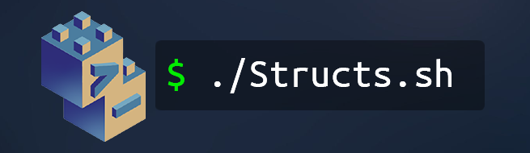
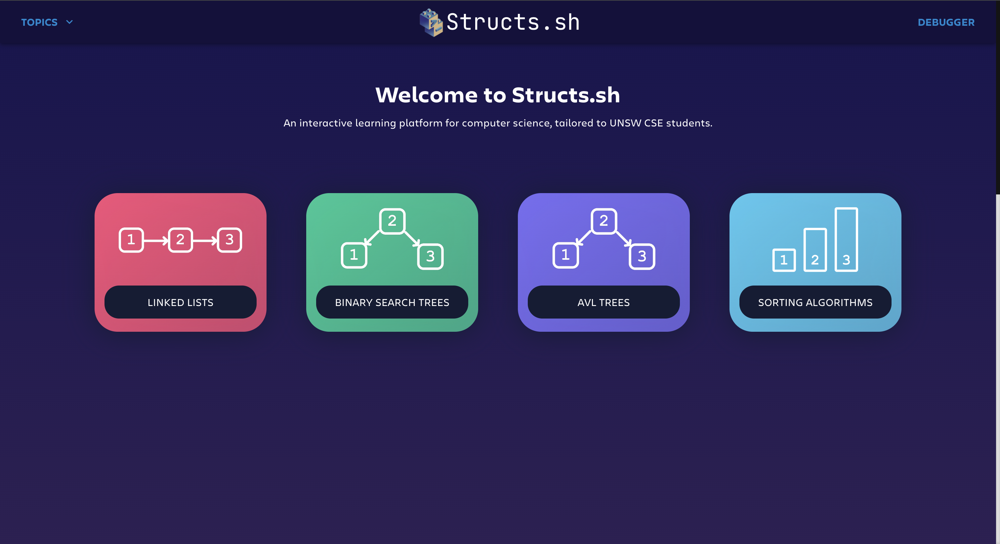
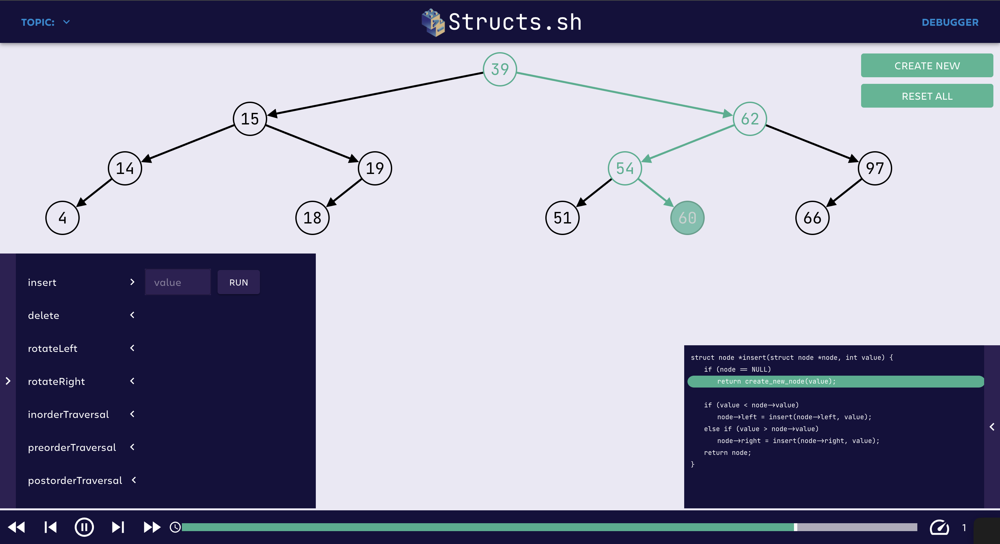
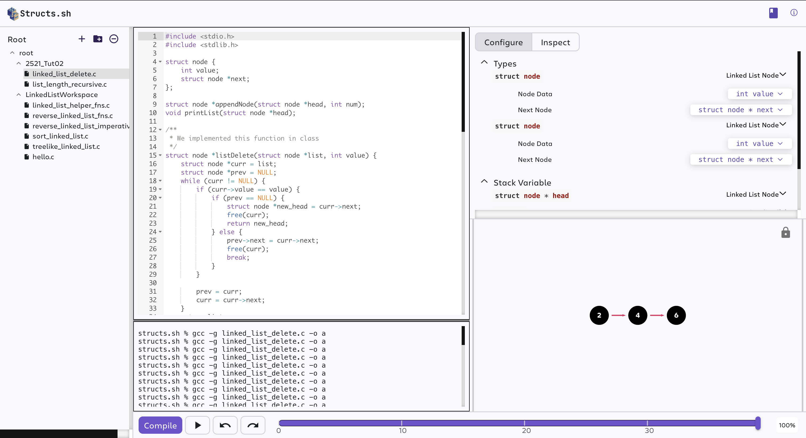

# Structs.sh 💻

  

  
  
  
  

> Looking to contribute? See the **[Contributing guide](contributing.md)**.

## About

Structs.sh is an interactive data structure and algorithm visualiser and educational platform for computer science students.

## Features

### Algorithm Visualiser

Interactive animated visualisations of classic data structures and algorithms, including (but not limited to):

* Linked Lists
* Binary Search Trees
* AVL Trees
* Graphs (in progress!)

### Visual Debugger

* Debug and visualise data structures in your own C code.
* Currently supports linked lists.

---

## Why Structs.sh?

Structs.sh aims to be a comprehensive educational resource for data structures and algorithms, developed by passionate computer science and engineering students at UNSW.

The project was inspired by **[Tactile-DS](https://github.com/Tymotex/Tactile-DS)**, a tutoring tool and reference implementation developed in 2020 for **[COMP2521](https://www.handbook.unsw.edu.au/undergraduate/courses/2022/COMP2521/?year=2022)**.

Structs.sh exists to bridge the gap between a student's high-level understanding of computer science concepts and how those concepts translate into real code. It was started by students who felt there was a lack of tools that help build strong visual intuition for algorithmic thinking.
