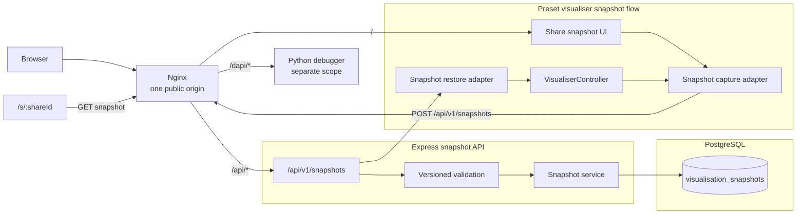

# Shareable visualisation snapshots: architecture

## Scope

This design applies to the preset algorithm visualisers reached from the homepage:

- Linked Lists
- Binary Search Trees
- AVL Trees
- Sorting Algorithms

It does **not** apply to `/debugger`, the C debugger service, debugger memory, user workspaces, or debugger recordings.

The first delivery is a Linked List proof of concept (POC). It creates an immutable, database-backed snapshot and a shareable URL. A snapshot records:

- the data-structure type;
- the values in the structure;
- the input state from which the selected algorithm can be replayed;
- the algorithm operation and arguments, when an operation is active or was the last action.

Exact playback state—such as the current animation step or timeline position—is a follow-up phase. The schema and API reserve space for it so the POC does not need a storage redesign.

## What the current application does

The homepage renders topic cards from `DataStructure` in `client/src/visualiser-src/common/typedefs.ts`. A card opens `/visualiser/:topic/:data?`, which renders the preset `VisualiserController`. The controller creates one of the four `GraphicalDataStructure` implementations using `GraphicalDataStructureFactory`.

The preset visualiser already exposes serialisable semantic data through `controller.data` and restores it through `controller.loadData(data)`. The existing development-only `CreateLink` places that integer data directly in the URL. It does not preserve the algorithm, arguments, playback position, schema version, or values outside its two-character encoding assumptions.

The server currently uses MongoDB/Mongoose for its unfinished save/load feature. This proposal does not describe MongoDB as a target architecture. New snapshot persistence uses PostgreSQL. Migrating unrelated user, workspace, or legacy save/load persistence is outside this feature.

## Important state-model constraint

`VisualiserController.doOperation` calls the selected data-structure method synchronously. That method mutates the semantic data structure while building a list of SVG animation runners. The controller then plays those runners on a timeline.

Consequently, during an animation:

- `controller.data` usually represents the operation's **result**, not necessarily what is currently visible;
- the SVG DOM is rendering an intermediate state;
- the controller does not retain the operation name, arguments, or pre-operation input;
- the timeline's runners and SVG element references are not suitable for JSON serialisation.

An exact visual snapshot must therefore be a replay recipe, not a serialised SVG timeline:

1. load the pre-operation semantic input;
2. execute the same operation with the same arguments;
3. reconstruct the deterministic timeline;
4. seek to the saved normalised position;
5. open paused so the recipient sees the shared instant.

The POC implements items 1 and 2 and restores the operation from its beginning. Phase 2 implements items 3–5.

## Proposed architecture

Nginx provides one public origin; it does not merge the services. It preserves
`/api/...` for the TypeScript server and `/dapi/...` for the Python Socket.IO
debugger. The debugger shares the gateway but never participates in snapshot
capture or restore. See [nginx-gateway.md](./nginx-gateway.md).

### Frontend responsibilities

- Capture semantic state from the preset visualiser, never from `/debugger`.
- Track the active or most recently invoked operation and its validated arguments.
- Retain a copy of the data immediately before invoking the operation.
- Convert internal names into stable wire identifiers such as `linked-list` and `append`.
- Send a versioned snapshot payload to the API.
- Open `/s/:shareId`, fetch the snapshot, validate the supported version, and restore it.
- Treat the API response as untrusted input even though the server validates it.

### API responsibilities

- Validate payload size, schema version, structure type, values, operation, and arguments.
- Generate an opaque UUID share ID on the server.
- Store snapshots as immutable rows in PostgreSQL.
- Return only the public snapshot representation; do not expose internal IDs or owner metadata.
- Apply request-size limits and rate limiting before public/anonymous creation is enabled.
- Return `404` for unknown, expired, or revoked share IDs.

### PostgreSQL responsibilities

- Provide durable, transactional storage for the snapshot recipe.
- Store common fields in typed columns and versioned structure/algorithm payloads in `jsonb`.
- Enforce basic JSON shape, paired algorithm fields, expiry, and uniqueness constraints.
- Keep snapshots immutable. A changed visualisation produces a new share ID.

## Snapshot boundaries

The canonical unit is one semantic snapshot, not a video file and not a stream of DOM changes.

| Concern | POC | Phase 2 |
|---|---|---|
| Structure | Linked List | All homepage presets |
| Structure values | Yes | Yes |
| Pre-operation input | Yes, when an algorithm is present | Yes |
| Algorithm name and arguments | Yes | Yes |
| Exact timeline cursor | No; restore at operation start | Yes |
| Playing/paused state | No; restore paused | Stored as metadata; restore paused |
| Speed and step mode | No | Yes |
| Share format | URL | URL; video export may be added separately |
| Debugger state | Out of scope | Out of scope |

## Why PostgreSQL and `jsonb`

The snapshot has stable relational metadata—ID, structure type, version, timestamps—and variant state for different structures and algorithms. PostgreSQL provides constraints, transactions, expiry queries, and indexes for the stable fields, while `jsonb` allows each structure to evolve under an explicit `schema_version`.

This is preferable to:

- putting the full snapshot in a URL, which creates length and compatibility limits;
- storing SVG/animation objects, which contain runtime references and are not portable;
- creating one table per structure before the cross-structure contract is stable;
- continuing the feature design around MongoDB when PostgreSQL is the selected database.

See [schema.sql](./schema.sql) for the proposed schema and [snapshot-contract.md](./snapshot-contract.md) for the versioned JSON contract.

## Compatibility and reproducibility

`renderer_version` identifies the client snapshot/replay implementation that created the row. `schema_version` identifies the stored payload shape. They solve different problems:

- schema migrations convert stored data between payload shapes;
- renderer compatibility determines whether the current client can reproduce an older animation.

The client must continue to support known schema versions or fail with a clear “snapshot version is no longer supported” message. A later renderer that changes timing may still restore the same semantic algorithm step; pixel-identical replay is not a POC guarantee.

## Security and privacy

- Share URLs are unlisted public links. Anyone with the URL can view the snapshot.
- A share ID is a random UUID, never a sequential database ID.
- Snapshot payloads contain visualiser state only. Do not store debugger memory, source files, access tokens, or arbitrary HTML/SVG.
- Values and operation names are allow-listed and size-limited.
- Snapshot rendering uses typed application data; it must not inject stored strings as markup.
- Phase 1 creation is anonymous and stores `owner_subject` as `NULL`. Later authenticated ownership, if added, uses an opaque application subject that is not returned by the public API.
- Revocation and expiry are represented in the schema even if the first POC only uses expiry.
- Public `/dapi` access executes untrusted C code and requires authentication,
  rate/resource limits, and an enabled process sandbox; Nginx alone is not a
  security boundary.

## Decisions deferred from the POC

- authenticated ownership after the anonymous POC;
- default expiry duration;
- a “copy as video” export path;
- snapshot history and editing;
- migration of legacy MongoDB save/load data;
- exact cross-version animation guarantees.
