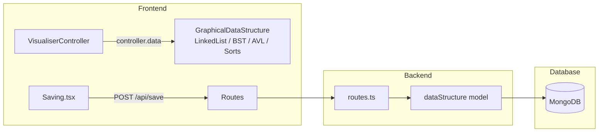

```mermaid
flowchart LR
  subgraph Frontend
    V[VisualiserController]
    GDS[GraphicalDataStructure<br/>LinkedList / BST / AVL / Sorts]
    S[Saving.tsx]
    V -->|controller.data| GDS
    S -->|POST /api/save| API
  end

  subgraph Backend
    R[routes.ts]
    M[dataStructure model]
    R --> M
  end

  subgraph Database
    DB[(MongoDB)]
    M --> DB
  end

  API[Routes] --> R
```
