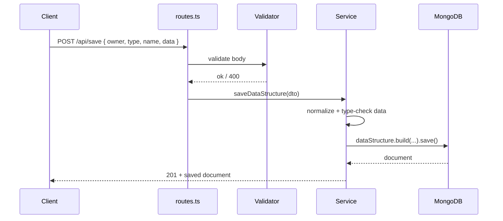

```mermaid
sequenceDiagram
  participant C as Client
  participant R as routes.ts
  participant V as Validator
  participant S as Service
  participant DB as MongoDB

  C->>R: POST /api/save { owner, type, name, data }
  R->>V: validate body
  V-->>R: ok / 400
  R->>S: saveDataStructure(dto)
  S->>S: normalize + type-check data
  S->>DB: dataStructure.build(...).save()
  DB-->>S: document
  S-->>C: 201 + saved document
```