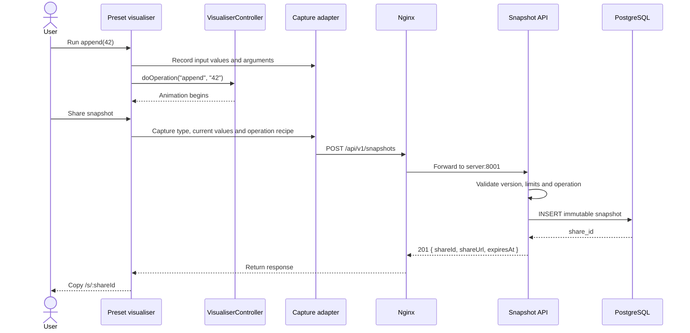
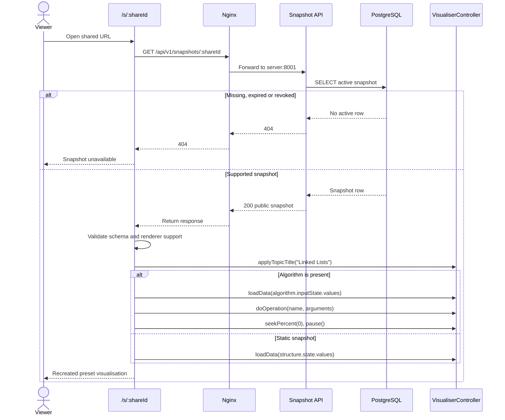

# Snapshot request and restore flows

## Create a Linked List snapshot

The POC records a replayable recipe. It must copy the pre-operation values before invoking an operation because the current visualiser mutates the list while it constructs the animation.



### Example creation request

```json
{
  "schemaVersion": 1,
  "rendererVersion": "preset-visualiser-v1",
  "title": "Appending 42",
  "structure": {
    "type": "linked-list",
    "state": {
      "values": [10, 20, 30, 42]
    }
  },
  "algorithm": {
    "name": "append",
    "arguments": {
      "value": 42
    },
    "inputState": {
      "values": [10, 20, 30]
    }
  }
}
```

If no operation is associated with the captured state, `algorithm` is omitted. The POC does not send `playback`.

## Restore a POC snapshot



The `structure.state` field is still returned for an algorithm snapshot. It is the semantic result captured by the sender and can be used to verify that replay produced the expected result.

## Phase 2: restore the exact algorithm position

Phase 2 adds a `playback` object:

```json
{
  "progress": 0.42,
  "status": "paused",
  "speed": 1,
  "stepMode": false
}
```

After rebuilding the operation timeline from `algorithm.inputState` and `algorithm.arguments`, the restore adapter seeks to `progress * 100` and pauses. The saved `status` describes the sender's state; shared links still open paused to avoid advancing before the viewer can see the shared instant.

The normalised progress value is canonical. A duration in milliseconds may be returned as diagnostic metadata, but it must not be the only cursor because timing can change between renderer versions.

## Failure responses

| Condition | Status | Error code |
|---|---:|---|
| Invalid JSON or contract | 400 | `INVALID_SNAPSHOT` |
| Unsupported `schemaVersion` | 422 | `UNSUPPORTED_SCHEMA_VERSION` |
| Unsupported structure/operation pair | 422 | `UNSUPPORTED_VISUALISATION` |
| Payload exceeds limits | 413 | `SNAPSHOT_TOO_LARGE` |
| Creation rate limit exceeded | 429 | `RATE_LIMITED` |
| Unknown, expired, or revoked share ID | 404 | `SNAPSHOT_NOT_FOUND` |
| Unexpected persistence failure | 500 | `SNAPSHOT_STORE_FAILED` |

Detailed validation errors should be logged server-side. Public errors must not reveal database details.
